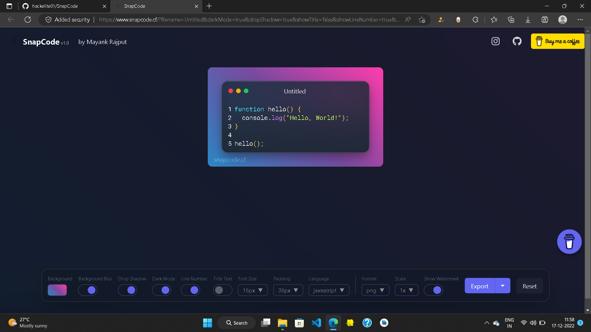

# SnapCode - The Amazing Code Snippet Tool



[](https://www.codefactor.io/repository/github/hackelite01/snapcode/overview/main)
[](https://opensource.org/licenses/MIT)
[](https://hacktoberfest.com/)

**SnapCode** is a beautifully designed web application that helps developers generate beautiful and customizable images of their code snippets. Built with Next.js, TypeScript, and Tailwind CSS, it's a developer tool created by developers, for developers.

## 🎃 Hacktoberfest 2025

This project is participating in **Hacktoberfest 2025**! 🎉

We're welcoming contributions from developers of all skill levels. Submit 6 quality pull requests to participating repositories between October 1-31 to earn digital badges and potentially a t-shirt!

### How to Contribute to Hacktoberfest
- Look for issues tagged with `hacktoberfest` or `good first issue`
- Check out our [Contributing Guidelines](CONTRIBUTING.md)
- Follow our [Code of Conduct](CODE_OF_CONDUCT.md)
- Submit quality pull requests that add value to the project

## ✨ Features

- 🎨 **Beautiful Code Images**: Generate stunning images of your code snippets
- 🌈 **Multiple Themes**: Choose from various CodeMirror themes
- 📱 **Responsive Design**: Works perfectly on desktop and mobile
- 🖥️ **Multiple Languages**: Support for 15+ programming languages
- 🎯 **Customizable**: Adjust fonts, colors, backgrounds, and more
- 🚀 **Fast & Lightweight**: Built with modern web technologies
- 🐳 **Docker Support**: Easy deployment with Docker
- 📦 **Export Options**: Save as PNG, JPG, or copy to clipboard

## 🚀 Quick Start

### Prerequisites
- Node.js 16+ and npm/yarn
- Git

### Local Development

1. **Clone the repository**
   ```bash
   git clone https://github.com/hackelite01/SnapCode.git
   cd SnapCode
   ```

2. **Install dependencies**
   ```bash
   npm install
   # or
   yarn install
   ```

3. **Run the development server**
   ```bash
   npm run dev
   # or
   yarn dev
   ```

4. **Open your browser**
   Navigate to [http://localhost:3000](http://localhost:3000)

### Docker Deployment

```bash
# Build and run with Docker Compose
docker-compose up -d
```

## 🛠️ Tech Stack

- **Frontend Framework**: Next.js 13+
- **Language**: TypeScript
- **Styling**: Tailwind CSS
- **Code Editor**: CodeMirror 6
- **State Management**: Jotai
- **UI Components**: Radix UI
- **Deployment**: Vercel
- **Containerization**: Docker

## 📋 Supported Languages

- JavaScript/TypeScript/JSX
- Python
- Java
- C/C++/C#
- PHP
- Rust
- Go
- Swift
- HTML/CSS/SCSS/SASS
- SQL
- JSON
- YAML
- XML
- Markdown
- And more!

## 🤝 Contributing

We welcome contributions! Please see our [Contributing Guidelines](CONTRIBUTING.md) for details on:

- How to set up the development environment
- Coding standards and best practices
- Pull request process
- Issue reporting

### Development Commands

```bash
# Install dependencies
npm install

# Start development server
npm run dev

# Build for production
npm run build

# Start production server
npm start

# Run linting
npm run lint
```

## 📖 Documentation

- [Contributing Guidelines](CONTRIBUTING.md)
- [Code of Conduct](CODE_OF_CONDUCT.md)
- [Security Policy](SECURITY.md)

## 🐛 Reporting Issues

Found a bug? Have a feature request? Please [open an issue](https://github.com/hackelite01/SnapCode/issues) and use the appropriate issue template.

## 📜 License

This project is licensed under the MIT License - see the [LICENSE](LICENSE) file for details.

## 🙏 Acknowledgments

- Built with ❤️ by [Mayank Rajput](https://github.com/hackelite01)
- Thanks to all our [contributors](https://github.com/hackelite01/SnapCode/graphs/contributors)
- Special thanks to the Hacktoberfest community

## 🌟 Support

- **Website**: [snapcode.cf](https://www.snapcode.cf)
- **Issues**: [GitHub Issues](https://github.com/hackelite01/SnapCode/issues)
- **Discussions**: [GitHub Discussions](https://github.com/hackelite01/SnapCode/discussions)
- **Support**: [Buy me a coffee](https://www.buymeacoffee.com/hackelite01) ☕

---

**FEEDBACKS & SUGGESTIONS ARE ACCEPTED!**  
*#Hacktoberfest2025* 🎃

---

*Made with ❤️ and lots of ☕*
